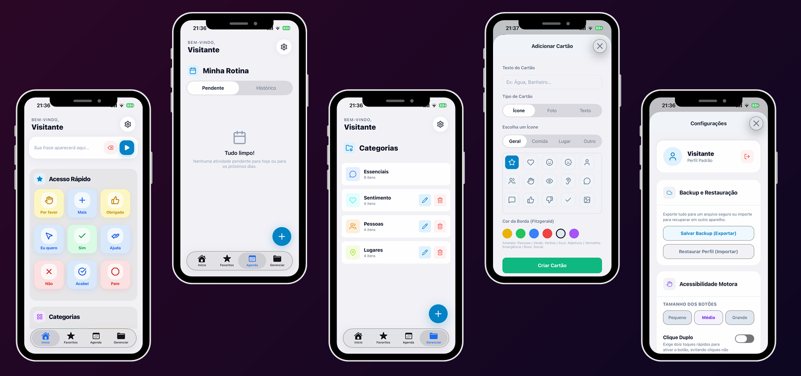

# Aura CA

Bem-vindo ao repositório do **Aura**, um aplicativo de Comunicação Alternativa e Aumentativa (CAA). 

## 📖 Sobre o Projeto
O Aura surgiu como um **projeto de Iniciação Científica (IC)**, desenvolvido com o objetivo de ajudar alunos com dificuldades de fala ou transtornos de comunicação. O projeto busca ser uma solução tecnológica acessível e de impacto social real para o dia a dia.

## 🎯 Finalidade
A finalidade principal da ferramenta é fornecer uma plataforma digital acessível, inclusiva e ágil. Permitindo que indivíduos com dificuldade na comunicação verbal possam expressar suas necessidades, sentimentos e pensamentos de forma clara, ajudando a promover autonomia e a inclusão social.

## ✨ Funções da Ferramenta

  

 

A ferramenta foi desenvolvida focando em usabilidade e eficiência na comunicação. Suas principais funções incluem:
- **Pranchas de Comunicação (AAC):** Interface rica contendo cartões e símbolos visuais para formar palavras e frases de forma ágil;
- **Síntese de Voz (Text-to-Speech):** Leitura em áudio das frases ou palavras selecionadas pelo usuário, permitindo o processo de vocalização;
- **Assistência com Inteligência Artificial:** Integração de serviços de IA para auxiliar na tradução, sugestões inteligentes e predição de estruturas para facilitar a conversa;
- **Personalização de Interface:** Áreas de configurações dedicadas para que o usuário ou cuidador adapte o aplicativo às suas próprias necessidades (tamanho, contrastes, preferências visuais, entre outros).

## 🚀 Tecnologias Utilizadas
Este aplicativo foi construído com ferramentas e bibliotecas modernas para garantir um bom desempenho tanto em Android quanto em iOS:
- **[React Native]** e **[Expo]**: Frameworks para o desenvolvimento móvel multiplataforma focado num excelente ecossistema e performance nativa.
- **[TypeScript]**: Superset de JavaScript utilizado para garantir uma base de código segura com checagem de tipagem estática.
- **[TailwindCSS]** e **[NativeWind]**: Responsáveis por toda a estilização, baseados em utilitários para construir interfaces responsivas e de rápido desenvolvimento.
- **[Expo Speech]**: Biblioteca poderosa que provê sintetização e leitura de texto em voz alta.
- **[Reanimated]** e **[Gesture Handler]**: Motores para gerenciar animações de alta performance a 60 fps e interações físicas/toques pela tela fluidas.
- **[AI Service]**: Comunicações via APIs e processamento de informações com Inteligência Artificial para tornar a ferramenta mais interativa.
- **[Lucide React Native]**: Biblioteca de ícones padrão para ilustrar interface e símbolos básicos.

---
